# 🛒 RRT E-Commerce App

A fully featured **Flutter-based e-commerce app** that allows users to register, log in, browse products, view product details, search with voice support, manage wishlist, cart, addresses, orders, and more — all integrated with a **Spring Boot backend**.

> 🔗 **Backend Repository:** [RRT E-Commerce Backend](https://github.com/barathan76/rrtbackend.git)

---

## ✨ Features

### 🔐 Authentication
- **Login, Register, Forgot Password**
- **Token-based Authentication**: On login, a JWT token is received and securely stored on the device.
- **Auto-login**: If a valid token exists, users are automatically logged in when they reopen the app — no need to log in again.

### 🏠 Home & Product Browsing
- Browse list of products
- Product details with image, price, and description

### 🔍 Search
- Text-based search
- 🎙️ Speech-to-text support for voice search

### ❤️ Wishlist
- Add/remove products from wishlist
- View all wishlisted products

### 🛒 Cart & Orders
- Add, update, and remove items from cart
- Confirm orders with selected address
- View order history and order details

### 📍 Address Management
- Add, edit, and delete addresses
- Select delivery address during checkout

### 🙍 Profile & Settings
- View and update user profile
- Change preferences in settings page

---

## 🧾 Screenshots

<div align="center">

<table>
  <tr>
    <td align="center">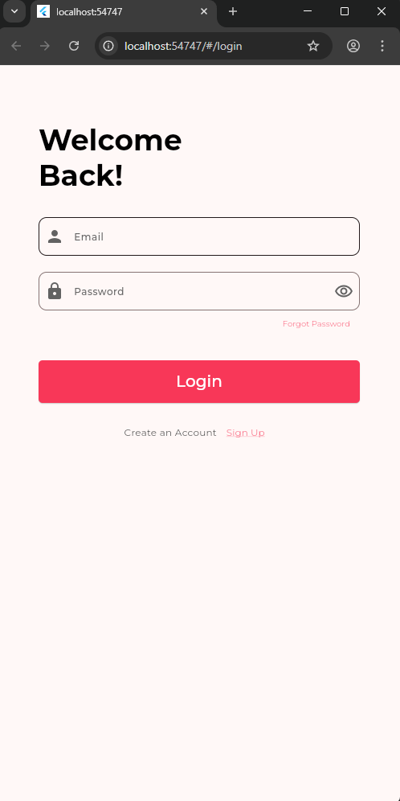<br/><i>Login Page</i></td>
    <td align="center">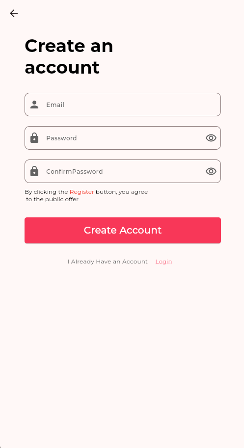<br/><i>Register Page</i></td>
    <td align="center">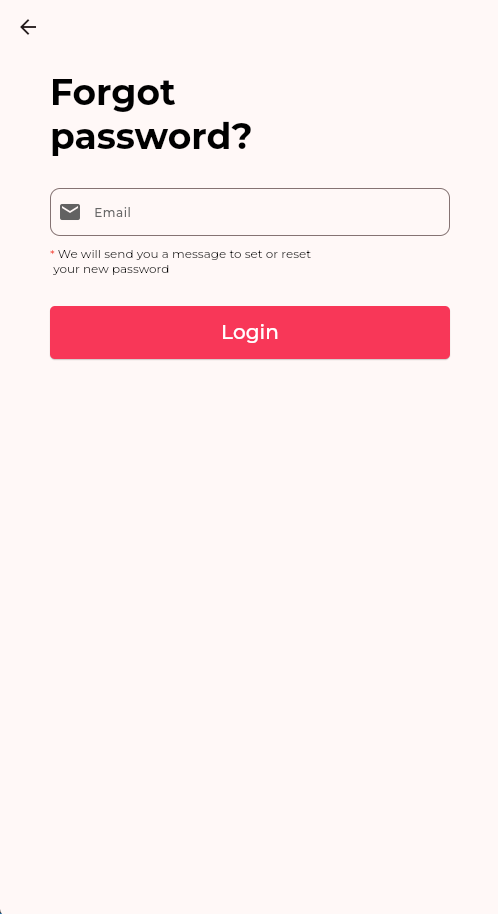<br/><i>Forgot Password</i></td>
  </tr>
  <tr>
    <td align="center">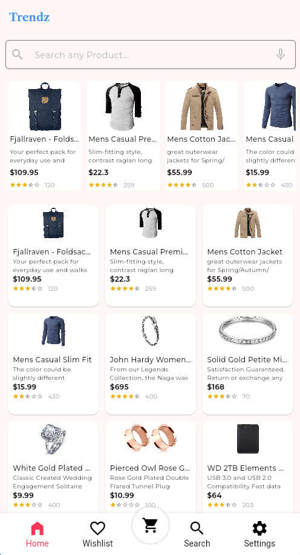<br/><i>Home Page</i></td>
    <td align="center">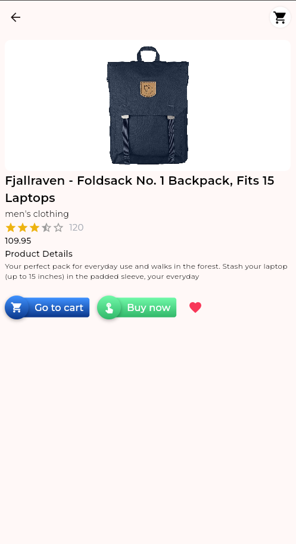<br/><i>Product Details</i></td>
    <td align="center">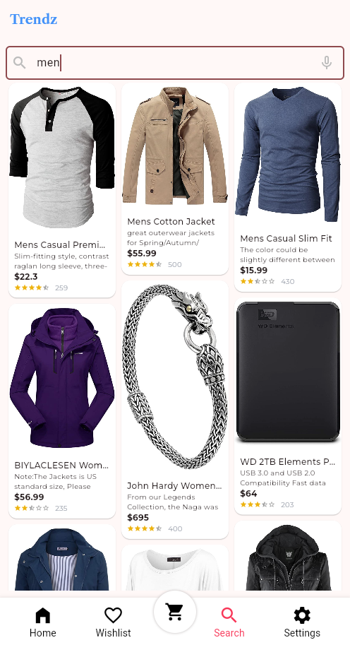<br/><i>Search Page</i></td>
  </tr>
  <tr>
    <td align="center">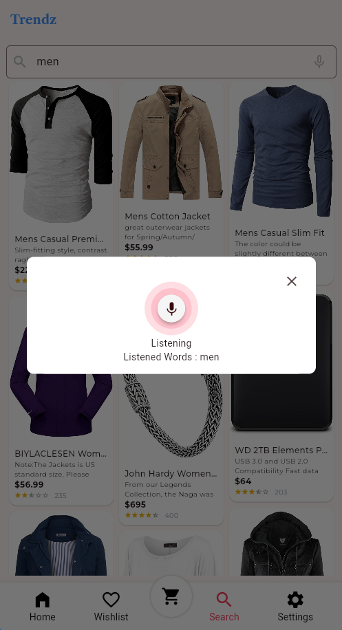<br/><i>Speech Search Dialog</i></td>
    <td align="center">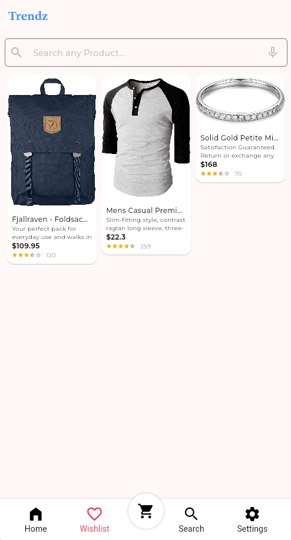<br/><i>Wishlist Page</i></td>
    <td align="center">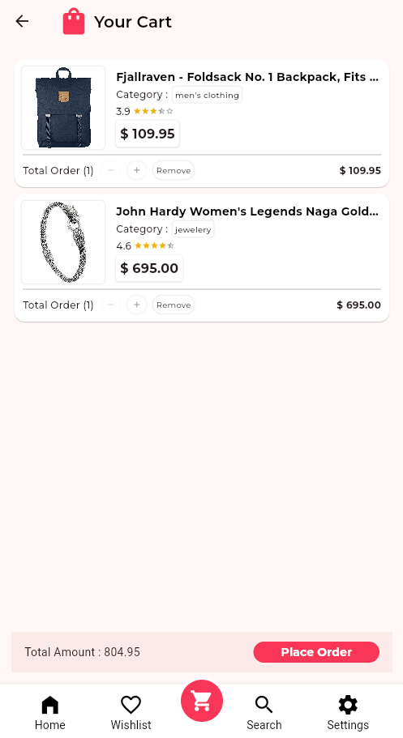<br/><i>Cart Page</i></td>
  </tr>
  <tr>
    <td align="center">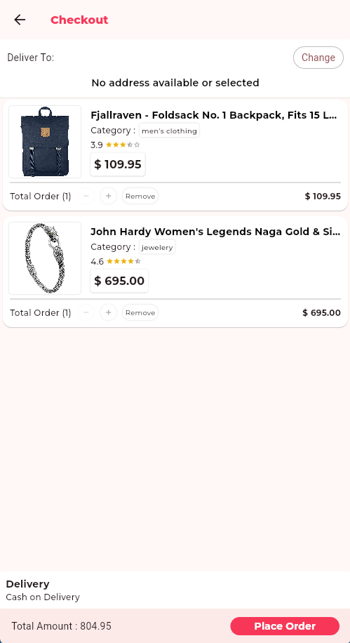<br/><i>Order Confirmation</i></td>
    <td align="center">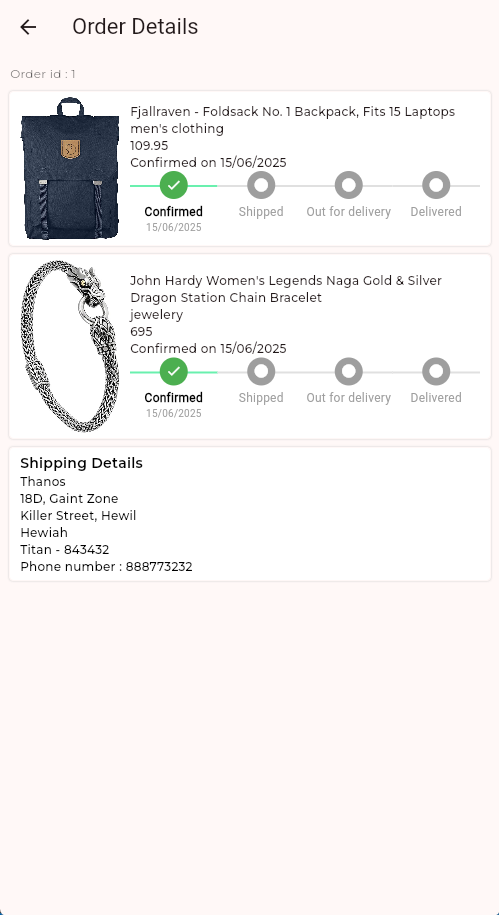<br/><i>Order Details</i></td>
    <td align="center">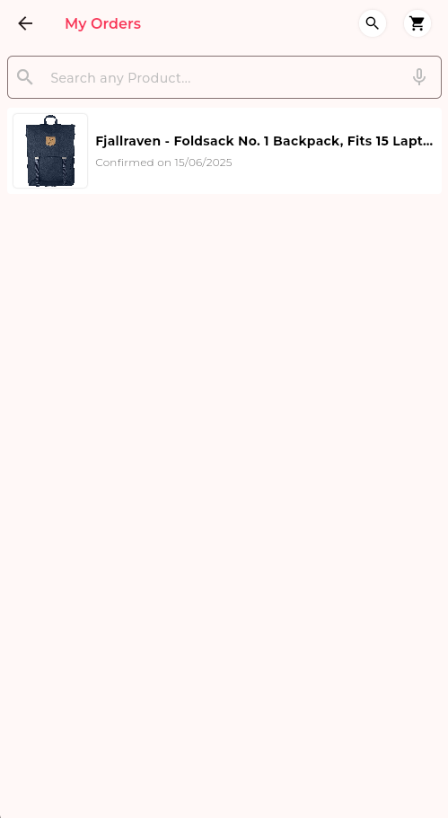<br/><i>Orders List</i></td>
  </tr>
  <tr>
    <td align="center">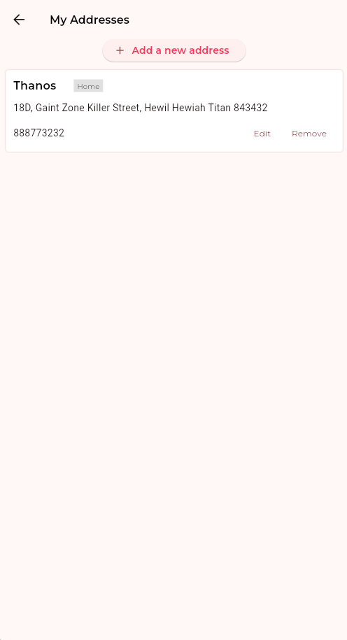<br/><i>Saved Address Page</i></td>
    <td align="center">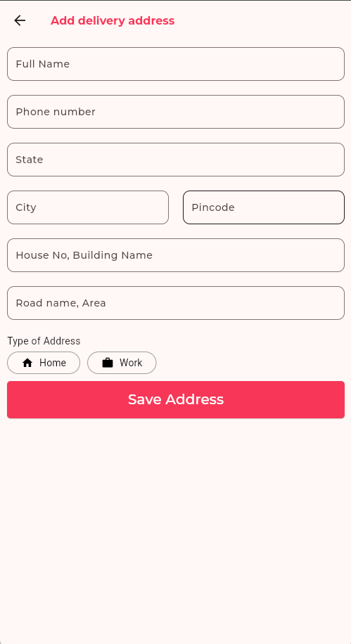<br/><i>Add Address</i></td>
    <td align="center">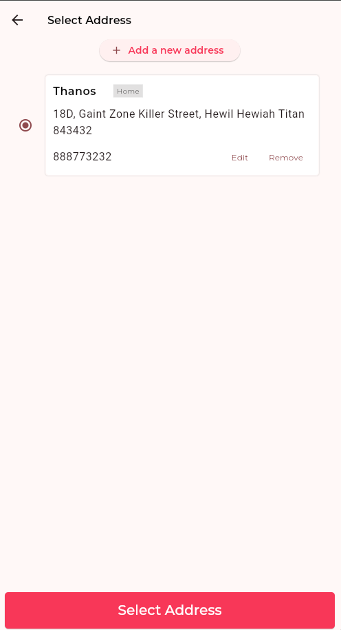<br/><i>Select Address</i></td>
  </tr>
  <tr>
    <td align="center">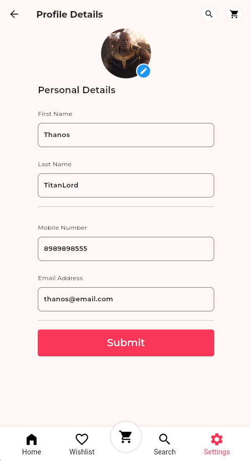<br/><i>Profile Page</i></td>
    <td align="center">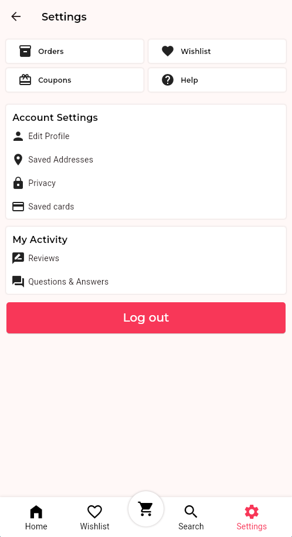<br/><i>Settings Page</i></td>
    <td></td>
  </tr>
</table>

</div>

---

## 🛠️ Tech Stack

### 💻 Frontend
- **Flutter**, **Dart**
- **State Management**: Provider / BLoC
- **Speech Recognition**: `speech_to_text`
- **Persistence**:
  - `shared_preferences` – Secure JWT token storage
- **Networking**: `http`

### ⚙️ Backend
- **Spring Boot**, **MySQL**, **JWT Auth**
- Manages: authentication, product catalog, cart, wishlist, orders, addresses, and profile

> 🔗 [View Backend Repository](https://github.com/barathan76/rrtbackend.git)

---

## 🚀 Getting Started

### 📦 Prerequisites

- Flutter SDK
- Spring Boot backend running locally or deployed

### ✅ API URL for Emulator

On Android Emulator, use `10.0.2.2` to access local backend:
change backEnd value in packages\api_repository\lib\src\utility\path.dart

```dart
const baseUrl = 'http://10.0.2.2:8080/api';
